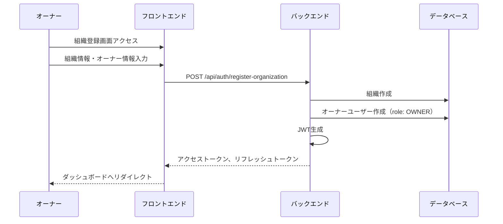
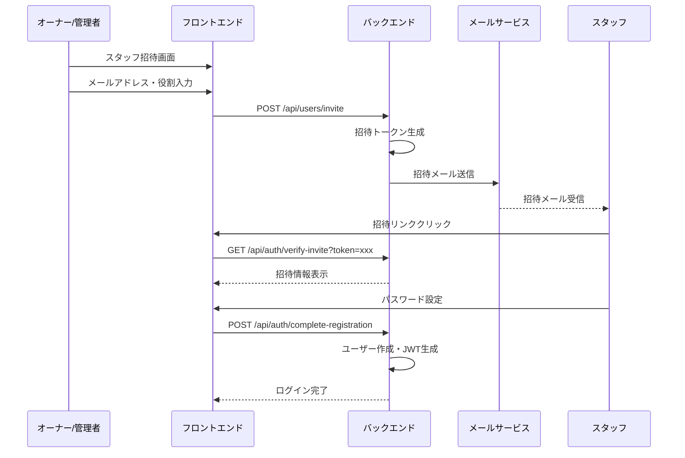
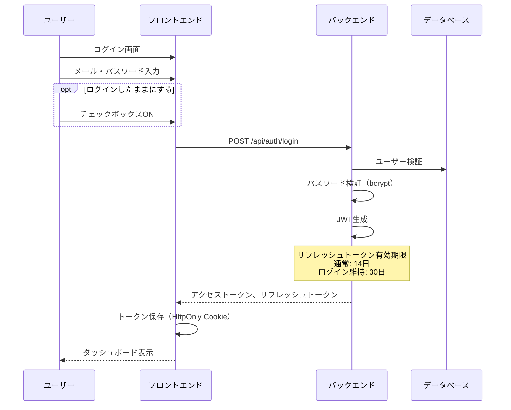
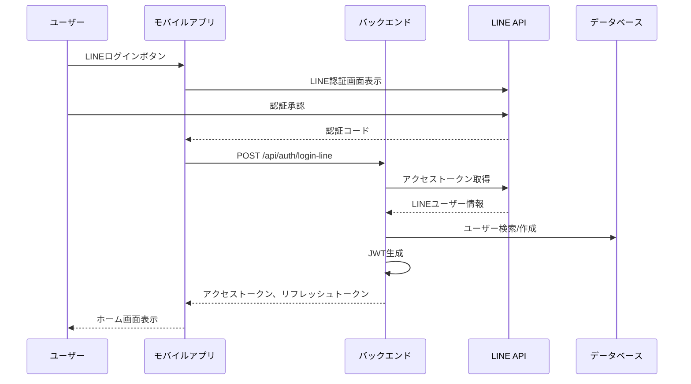
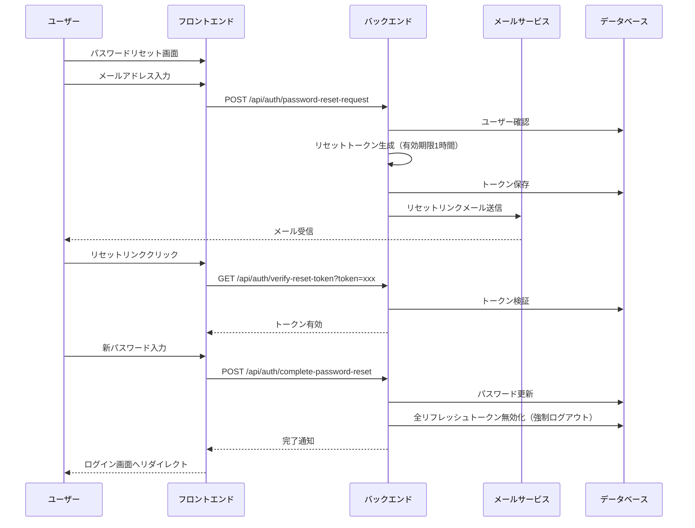
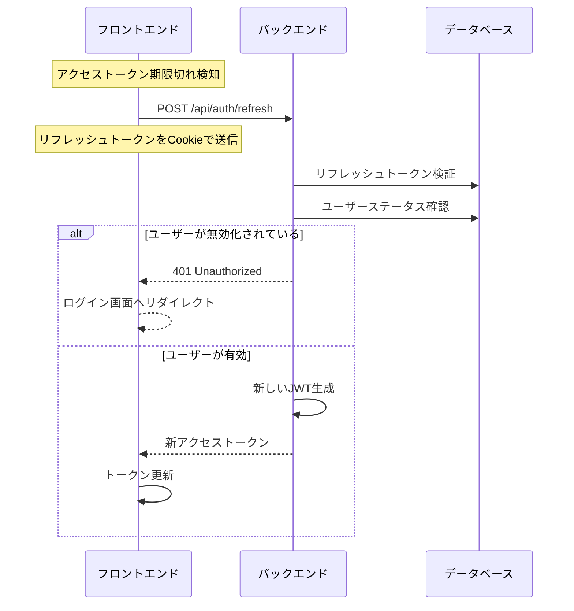

# 認証システム設計書

## 1. 概要

このドキュメントでは、Salomoni × Iroha統合アプリケーションの認証システムの詳細設計を定義します。本システムは、美容業界のスタイリストとサロンオーナーを支援する統合アプリケーションとして、セキュアかつ使いやすい認証機能を提供します。

## 2. 認証メカニズム

### 2.1 選定方式

**JWT（JSON Web Token）ベースの認証**
- アクセストークン: 短期間有効（30分）
- リフレッシュトークン: 長期間有効（14日、「ログインしたままにする」選択時は30日）

### 2.2 選定理由

- **ステートレス性**: サーバー側でセッション管理が不要、スケーラビリティの確保
- **モバイル/Web両対応**: 同一の認証方式で両プラットフォームをサポート
- **複数デバイス対応**: 同一ユーザーの複数デバイス同時ログインが容易
- **柔軟な有効期限管理**: アクセストークンとリフレッシュトークンの分離により、セキュリティと利便性のバランスを実現

### 2.3 認証方式の使い分け

| プラットフォーム | 対応認証方式 | 備考 |
|--------------|-----------|------|
| モバイルアプリ | LINE認証、メール認証 | LINEを優先的に表示 |
| 管理サイト | メール認証のみ | Owner/Admin向け |
| SuperAdminサイト | メール認証のみ | 運営スタッフ向け |

## 3. 認証フロー

### 3.1 新規登録フロー（組織作成）



### 3.2 スタッフ招待フロー



### 3.3 ログインフロー（メール認証）



### 3.4 ログインフロー（LINE認証）



### 3.5 パスワードリセットフロー



### 3.6 トークン更新フロー



## 4. セキュリティ対策

### 4.1 パスワード管理

- **ハッシュアルゴリズム**: bcrypt（コスト係数 10）
- **パスワードポリシー**: 最低8文字（特殊文字・英数字混在は不要）
- **パスワード履歴**: 実装しない（ユーザビリティ優先）

### 4.2 トークン管理

| トークン種別 | 有効期限 | 保存場所 | 備考 |
|------------|---------|---------|------|
| アクセストークン | 30分 | メモリ/LocalStorage | API呼び出し時に使用 |
| リフレッシュトークン | 14日（通常）<br>30日（ログイン維持） | HttpOnly, Secure Cookie | トークン更新時のみ使用 |

### 4.3 セキュリティヘッダー

```javascript
// 必須セキュリティヘッダー
{
  "Strict-Transport-Security": "max-age=31536000; includeSubDomains",
  "X-Content-Type-Options": "nosniff",
  "X-Frame-Options": "DENY",
  "X-XSS-Protection": "1; mode=block",
  "Content-Security-Policy": "default-src 'self'"
}
```

### 4.4 レート制限

- **ログイン試行**: 5回失敗で15分間ロック
- **API全般**: 100回/分/IP（緩和された制限）
- **パスワードリセット**: 3回/時間/メールアドレス

### 4.5 強制ログアウト機能

管理者による強制ログアウト実装:
1. 管理画面から対象ユーザーを選択
2. 「強制ログアウト」ボタンをクリック
3. 該当ユーザーの全リフレッシュトークンを無効化
4. 次回のAPI呼び出し時に401エラーを返却
5. クライアント側でログイン画面へリダイレクト

## 5. ユーザーステータス管理

### 5.1 ユーザーステータス

```typescript
enum UserStatus {
  ACTIVE = 'active',        // アクティブ（通常状態）
  INACTIVE = 'inactive',    // 無効化（退職・退会）
  SUSPENDED = 'suspended',  // 一時停止（違反等）
  PENDING = 'pending'       // 招待承認待ち
}
```

### 5.2 ステータス遷移

- **PENDING → ACTIVE**: 招待承認・初回ログイン完了時
- **ACTIVE → INACTIVE**: 退職・退会処理時（UI上は「削除」と表示）
- **ACTIVE → SUSPENDED**: 利用規約違反等での一時停止
- **SUSPENDED → ACTIVE**: 管理者による停止解除
- **INACTIVE**: 復帰不可（データは保持）

## 6. コード構造とアーキテクチャガイドライン

### 6.1 認証関連コードの構成

バックエンド側の認証関連コードは `features/auth/` ディレクトリに集約:

```
backend/src/features/auth/
├── auth.controller.ts      # リクエスト処理とレスポンス整形
├── auth.service.ts         # 認証ロジックの中核と業務処理
├── auth.routes.ts          # エンドポイント定義とミドルウェア適用
├── auth.middleware.ts      # JWT検証と権限チェック
├── auth.validator.ts       # 入力検証ルール
├── token.service.ts        # JWT生成・検証処理
├── password.service.ts     # パスワードハッシュ・検証
└── auth.types.ts          # 認証関連の型定義（types/index.tsを参照）
```

### 6.2 フロントエンド認証管理

```
frontend/src/features/auth/
├── contexts/
│   └── AuthContext.tsx     # 認証状態のグローバル管理
├── hooks/
│   ├── useAuth.ts         # 認証関連の共通フック
│   └── useTokenRefresh.ts # 自動トークン更新フック
├── services/
│   ├── authService.ts     # 認証API呼び出し
│   └── tokenService.ts    # トークン管理（保存・取得・削除）
├── components/
│   ├── LoginForm.tsx      # ログインフォーム
│   ├── ProtectedRoute.tsx # 認証必須ルート
│   └── RoleGuard.tsx      # ロールベースアクセス制御
└── pages/
    ├── LoginPage.tsx      # ログイン画面
    └── PasswordReset.tsx  # パスワードリセット画面
```

### 6.3 依存関係と責任分離

- **単方向依存**: 認証モジュールは他の機能モジュールに依存しない
- **イベント駆動**: 認証状態の変更は、イベントシステムで他モジュールに通知
- **エラーハンドリング**: 認証エラーは専用のエラーハンドラーで一元管理
- **設定の外部化**: 認証設定（有効期限等）は環境変数から注入

### 6.4 ミドルウェア構成

```typescript
// 認証ミドルウェアの適用例
app.use('/api/users', authenticate);  // 認証必須
app.use('/api/admin', authenticate, authorize(['admin', 'owner']));  // 認証＋権限チェック
app.use('/api/superadmin', authenticate, authorize(['superadmin']));  // SuperAdminのみ

// 公開エンドポイント（認証不要）
const publicEndpoints = [
  '/api/auth/login',
  '/api/auth/register',
  '/api/auth/password-reset-request',
  '/api/auth/verify-reset-token',
  '/api/auth/complete-password-reset'
];
```

## 7. エラーハンドリング

### 7.1 認証エラーコード

| エラーコード | HTTPステータス | 説明 | 対処法 |
|------------|--------------|------|--------|
| AUTH001 | 401 | 認証情報が無効 | 再ログインを促す |
| AUTH002 | 401 | トークン期限切れ | リフレッシュトークンで更新 |
| AUTH003 | 403 | 権限不足 | アクセス権限なしを表示 |
| AUTH004 | 429 | レート制限超過 | 時間をおいて再試行を促す |
| AUTH005 | 400 | パスワード要件未満 | 8文字以上を案内 |
| AUTH006 | 404 | ユーザー未存在 | 登録を促す |
| AUTH007 | 423 | アカウントロック | 管理者に連絡を促す |

### 7.2 エラーレスポンス形式

```json
{
  "success": false,
  "error": {
    "code": "AUTH001",
    "message": "認証情報が無効です",
    "details": {
      "field": "password",
      "reason": "incorrect_password"
    }
  }
}
```

## 8. 認証関連の環境変数

```env
# JWT設定
JWT_SECRET=your-secret-key-here
JWT_ACCESS_EXPIRY=30m
JWT_REFRESH_EXPIRY=14d
JWT_REFRESH_EXPIRY_REMEMBER=30d

# bcrypt設定
BCRYPT_ROUNDS=10

# レート制限
LOGIN_RATE_LIMIT=5
LOGIN_LOCKOUT_DURATION=15m
API_RATE_LIMIT=100

# LINE認証（モバイルアプリ用）
LINE_CHANNEL_ID=your-line-channel-id
LINE_CHANNEL_SECRET=your-line-channel-secret
LINE_CALLBACK_URL=your-callback-url

# メール設定
SMTP_HOST=smtp.example.com
SMTP_PORT=587
SMTP_USER=noreply@salomoni.jp
SMTP_PASS=your-smtp-password
```

## 9. 実装優先順位

1. **フェーズ1（MVP）**
   - メール認証（登録・ログイン）
   - JWT発行・検証
   - 基本的な権限チェック
   - パスワードリセット

2. **フェーズ2**
   - LINE認証統合
   - 強制ログアウト機能
   - レート制限実装
   - 「ログインしたままにする」機能

3. **フェーズ3**
   - 詳細な監査ログ（必要に応じて）
   - 多要素認証（将来的な拡張）